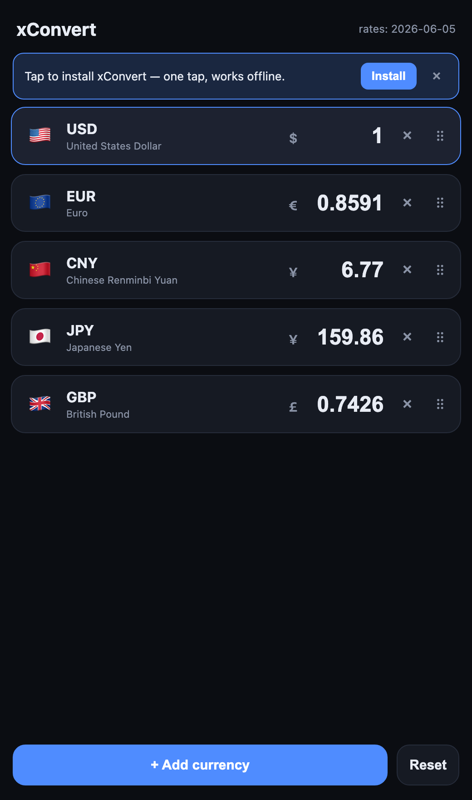

# xConvert

Convert one amount into many currencies at once — an installable, offline web app.

[](https://zl190.github.io/xcurrency-web/)


<p align="center">
  
</p>

You type an amount in **any** row and every other currency updates instantly — no "from/to" dropdowns, no swapping direction. It installs to your phone's home screen like a native app and keeps working with no signal. There's no account, no ads, and nothing to pay.

**→ Try it: https://zl190.github.io/xcurrency-web/**

## Quick start

It's a website — just open it. To keep it one tap away and working offline, install it:

1. Open **https://zl190.github.io/xcurrency-web/**
2. **iPhone (Safari):** tap **Share** → **Add to Home Screen**
3. **Android (Chrome):** tap the **Install** prompt (or ⋮ → *Install app*)
4. **Desktop (Chrome/Edge):** click the **install icon** in the address bar

After the first open it runs offline from its last fetched rates.

## Features

- **Edit any row** — type in a currency and all others convert live (no direction to pick).
- **Multiple currencies at once** — add any of 30 currencies via search; remove with ×.
- **Drag to reorder** — grab the handle to put your most-used currencies on top; the order is remembered.
- **Per-currency symbols** ($, €, ¥, £ …) in a clean aligned column.
- **Reset** — one tap returns to the base currency at `1`, i.e. a live rate table.
- **Installable PWA** — home-screen icon, full-screen, **works offline**.
- **Auto-updating rates** — fetched on open, on focus, and on reconnect; tap the date to refresh.
- **Remembers your setup** — your currencies, order, and last amount persist locally on your device.

## How it works

xConvert is a **single static page** — one `index.html` with inline CSS and JavaScript, no framework and no build step.

- **Rates** come from [frankfurter.dev](https://frankfurter.dev) (European Central Bank reference rates) — free, no API key.
- **Offline** is handled by a service worker that caches the app shell **stale-while-revalidate**: it loads instantly from cache and refreshes in the background, so updates land automatically on the next open.
- **Reordering** uses [SortableJS](https://github.com/SortableJS/Sortable), bundled locally so nothing is fetched at runtime.
- **State** (your currencies, order, and amount) lives in `localStorage`.

## Local development

No toolchain required — it's static files.

```bash
git clone https://github.com/zl190/xcurrency-web.git
cd xcurrency-web
python3 -m http.server 8000   # or any static server
# open http://localhost:8000
```

Deploy by serving the folder anywhere static (GitHub Pages, Cloudflare Pages, Netlify). This repo is published with GitHub Pages from `main`.

## Rates & accuracy

Rates are **daily European Central Bank reference rates**, which publish only on business days. On weekends and holidays the date shown is the previous business day (e.g. a Saturday shows Friday's rate) — that's the latest figure that exists, not a stale cache. Crypto and live intraday rates are out of scope.

## Roadmap

- [x] Live multi-currency conversion (edit any row)
- [x] Installable, offline PWA with auto-updating rates
- [x] Drag-to-reorder, add/remove, per-currency symbols
- [ ] Optional "a new version is available — reload" prompt
- [ ] Optional crypto / intraday rates (would require a keyed data source)

## Acknowledgments

- Exchange rates by [Frankfurter](https://frankfurter.dev) (ECB data).
- Drag-and-drop by [SortableJS](https://github.com/SortableJS/Sortable).

## License

[MIT](LICENSE) — fork it, ship your own.
